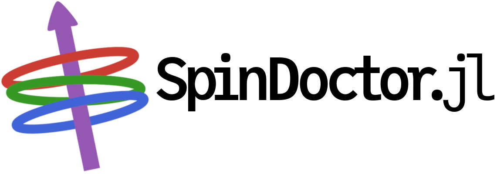
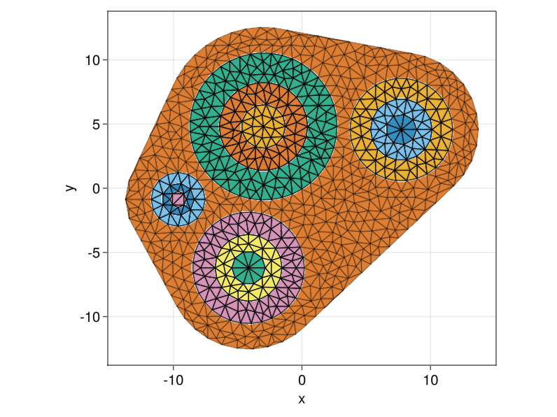
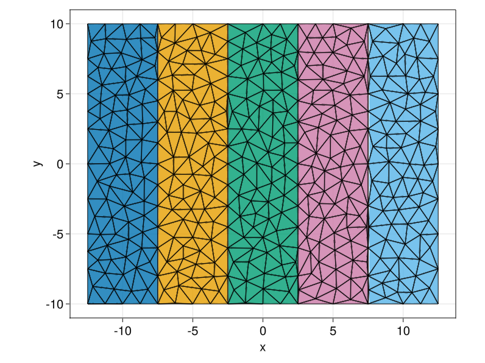
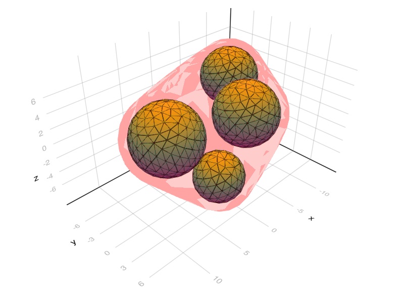
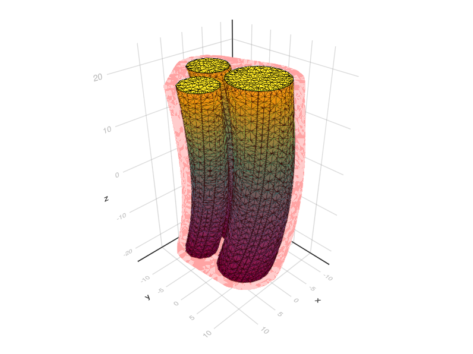
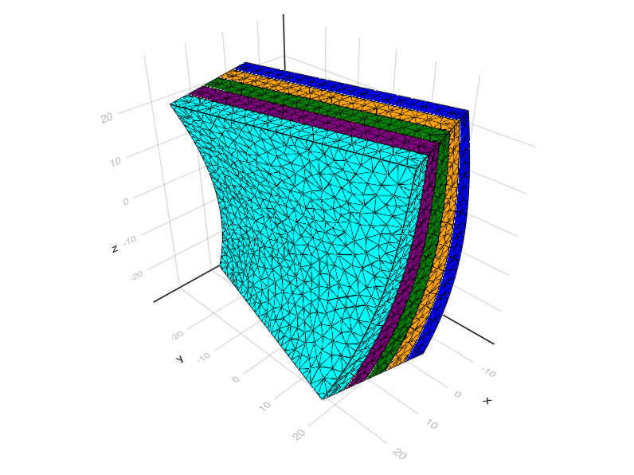
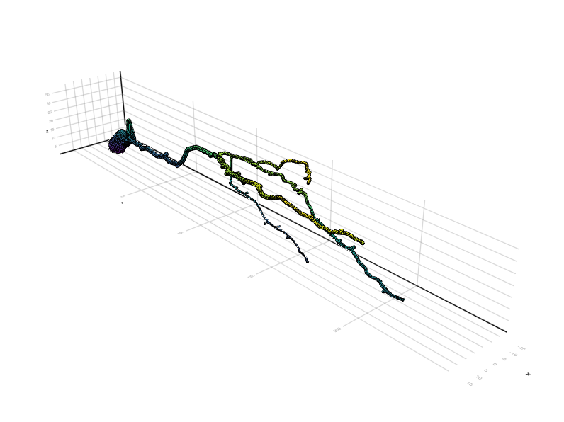
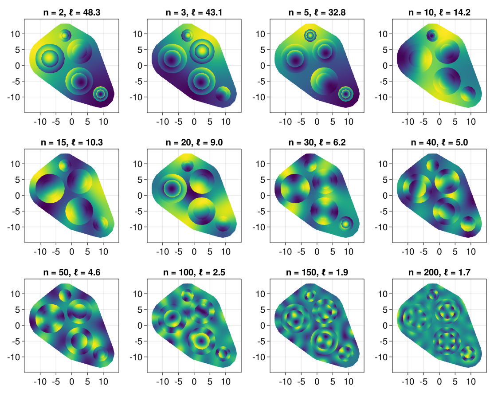
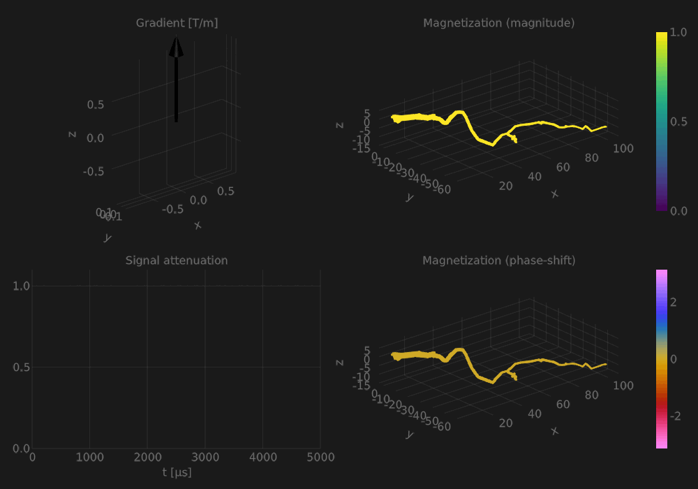

# SpinDoctor

| Documentation | Workflows | Code coverage | Quality assurance |
| :-----------: | :-------: | :-----------: | :---------------: |
|   |  |  |  |

This is a Julia implementation of the SpinDoctor toolbox. The original MATLAB toolbox can be
found at <https://github.com/SpinDoctorMRI/SpinDoctor>.

## Getting started

1. The `examples` folder contains drivers showing how to create geometry and solve
   different problems.
2. The input files for the drivers are found in the folder `examples/setups`, and define
   different models.
3. Multiple neuron meshes are available from
   [RealNeuronMeshes](https://github.com/SpinDoctorMRI/RealNeuronMeshes). These can be loaded in
   the file `examples/setups/neuron.jl`.
4. See the [documentation page](https://spindoctormri.github.io/SpinDoctor.jl/dev) for more details.

## Gallery

### Setup recipes

|              |      |      |
|:---------------------------------------------:|:---------------------------------------:|:-----------------------------------------:|
| [DiskSetup](examples/setups/disks.jl)         | [PlateSetup](examples/setups/plates.jl) | [SphereSetup](examples/setups/spheres.jl) |
|      |        |        |
| [CylinderSetup](examples/setups/cylinders.jl) | [SlabSetup](examples/setups/slabs.jl)   | [NeuronSetup](examples/setups/neuron.jl)  |

### Matrix formalism with Laplace eigenfunctions

### Spinning spindle spins in SpinDoctor

The above graphic visualizes the real part of the magnetization as a z-displacement for the
spindle neuron geometry `03b_spindle4aACC` (extracted from
[NeuroMorpho](http://neuromorpho.org/)). The gradient is a PGSE sequence in the x-direction.
The magnetization was saved for 200 time steps, and the exported VTK sequence was visualized
using [ParaView](https://www.paraview.org).

### Test new gradient sequences with live plotting

Here the magnetization is shown in a dendrite branch during a three-dimensional gradient
sequence.

## About

SpinDoctor is a software package that performs numerical simulations of diffusion magnetic
resonance imaging (dMRI) for prototyping purposes.

SpinDoctor can be used

1. to solve the Bloch-Torrey partial differential equation (BTDPE) to obtain the dMRI signal
   (the toolbox provides a way of robustly fitting the dMRI signal to obtain the fitted
   Apparent Diffusion Coefficient (ADC));
2. to solve the diffusion equation for the homogenized ADC (HADC) model to obtain the ADC;
3. a short-time approximation formula for the ADC is also included in the toolbox for
   comparison with the simulated ADC;
4. Compute the dMRI signal using a matrix formalism (MF) analytical solution based Laplace
   eigenfunctions.

The PDEs and Laplace eigenvalue decompositions are solved by P1 finite elements. The
geometry recipes create surface triangulations that are passed to
[TetGen](https://wias-berlin.de/software/index.jsp?id=TetGen&lang=1) to perform the finite
element mesh generation. For 2D geometries, as similar approach is used, with
[Triangle](https://www.cs.cmu.edu/~quake/triangle.html).

SpinDoctor has support for the following features:

1. multiple compartments connected through permeable membranes, with different
   * initial spin densities,
   * diffusion tensors,
   * T2-relaxation, and
   * permeability coefficients for the BTPDE and MF (the HADC assumes negligible
     permeability);
2. diffusion-encoding gradient pulse sequences, including
   * the pulsed gradient spin echo sequence (PGSE),
   * the double-PGSE,
   * the oscillating gradient spin echo (OGSE), and
   * custom three-dimensional pulse sequences `g⃗(t) = (g_x(t), g_y(t),
     g_z(t))`;
3. uniformly distributed gradient directions in 2D and 3D for high angular resolution
   diffusion imaging (HARDI).
4. Live plotting utilities
5. Export VTK snapshots or time series to visualize finite element magnetization
   fields in [ParaView](https://www.paraview.org).

SpinDoctor also comes with a geometry generation module, allowing for

1. multilayered spherical cells with a nucleus;
2. multilayered disk and cylinder cells with a myelin layer;
3. an extra-cellular space (ECS) enclosed in either a box, a convex hull, or a tight
   wrapping around the cells;
4. stacks of plates or slab cells;
5. deformation of canonical cells by bending and twisting.

In addition, a variety of neuron meshes is available, whose surface geometries were
extracted from [NeuroMopho.org](http://neuromorpho.org). The neurons may also be enclosed in
an extracellular space as described above.

## How to cite us

If you use our software for research, please consider citing us. See
[CITATION.md](CITATION.md) for further details.
