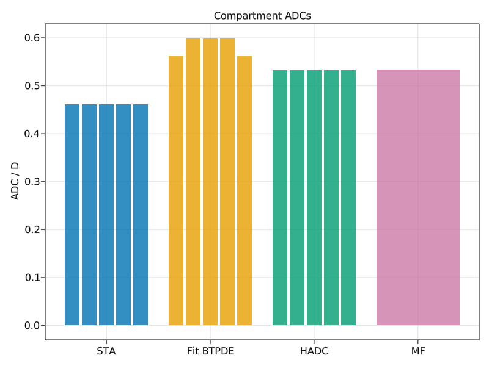
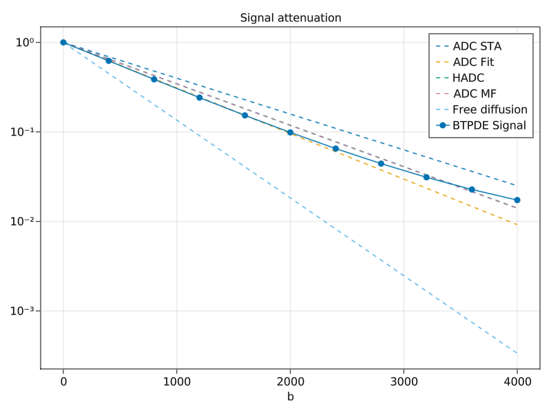

# Compare ADCs

SpinDoctor comes with multiple approaches for computing the apparent diffusion coefficient
(ADC)
for a `ScalarGradient` $\vec{g}(t) = f(t) g \vec{d}$:

- The free diffusion coefficient $\frac{\vec{d}' D \vec{d}}{\vec{d}' \vec{d}}$, which
    represents unrestricted diffusion in the absence of boundaries
- Computing the short diffusion time approximation for the ADC
- Fitting the signal obtained by solving the BTPDE for different $b$-values
- Solving a homogenized model (HADC)
- Using the matrix formalism effective diffusion tensor

In this example we will compare the different approaches for a mesh.

We start by loading SpinDoctor, and a Makie plotting backend.

```julia
using SpinDoctor
using LinearAlgebra
using GLMakie
```

Here we create a recipe for five stacked plates with isotropic diffusion tensors. They
should allow for free diffusion in the horizontal direction, but a rather restricted
vertical diffusion with the permeable membranes.

```julia
setup = PlateSetup(;
    name = "plates/someplates",
    width = 50.0,
    depth = 50.0,
    heights = fill(5.0, 5),
    bend = 0.0,
    twist = 0.0,
    refinement = 10.0,
)

ncell = length(setup.heights)

coeffs = coefficients(
    setup;
    D = [0.002 * I(3) for _ = 1:ncell],
    T₂ = fill(Inf, ncell),
    ρ = fill(1.0, ncell),
    κ = (; interfaces = fill(1e-4, ncell - 1), boundaries = fill(0.0, ncell)),
    γ = 2.67513e-4,
)
```

We then proceed to assemble the biological model and finite element matrices.

```julia
mesh, = create_geometry(setup; recreate = true)
model = Model(; mesh, coeffs...)
volumes = get_cmpt_volumes(model.mesh)
D_avg = 1 / 3 * tr.(model.D)' * volumes / sum(volumes)
ncompartment = length(model.mesh.points)
matrices = assemble_matrices(model);
```

The gradient pulse sequence will be a PGSE with both vertical and horizontal components.

```julia
dir = [1.0, .0, 1.0]
profile = PGSE(2500.0, 4000.0)
b = 1000
g = √(b / int_F²(profile)) / model.γ
gradient = ScalarGradient(dir, profile, g)
```

A simple model for the ADC is given by the [short term approximation](@ref STA).

```julia
adc_sta_cmpts = compute_adc_sta(model, gradient)
adc_sta = volumes'adc_sta_cmpts / sum(volumes)
```

A more robust approach is to directly fit the BTPDE signal to a series of b-values. This is
however more computationally expensive.

```julia
bvalues = 0:400:4000
gvalues = map(b -> √(b / int_F²(profile)) / coeffs.γ, bvalues)
gradients = [ScalarGradient(gradient.dir, gradient.profile, g) for g ∈ gvalues]
```

We first have to compute the magnetization.

```julia
btpde = IntervalConstanBTPDE(; model, matrices, θ = 0.5, timestep = 5)
ξ, = solve_multigrad(btpde, gradients)
```

The signals can be computed from the magnetization field.

```julia
signals = [compute_signal(matrices.M, ξ) for ξ ∈ ξ]
signals_cmpts = [compute_signal.(matrices.M_cmpts, split_field(model.mesh, ξ)) for ξ ∈ ξ]
```

Fitting the ADC is straightforward.

```julia
adc_fit = fit_adc(bvalues, signals)
adc_fit_cmpts =
    [fit_adc(bvalues, [s[icmpt] for s ∈ signals_cmpts]) for icmpt = 1:ncompartment]
```

The [HADC](@ref)-model uses homenization and assumes negligible permeability between the
compartments.

```julia
hadc = HADC(; model, matrices, reltol = 1e-4, abstol = 1e-6)
adc_homogenized_cmpts = solve(hadc, gradient)
adc_homogenized = volumes'adc_homogenized_cmpts / sum(volumes)
```

If a Laplace eigendecomposition is available, the ADC can be approximated with little
additional computational expense.

```julia
# Perform Laplace eigendecomposition
laplace = Laplace(; model, matrices, neig_max = 400)
lap_eig = solve(laplace)
```

An effective diffusion tensor is fitted.
```julia
D_mf = compute_mf_diffusion_tensor(model.mesh, matrices.M, lap_eig, gradient)
```

```
3×3 Matrix{Float64}:
  0.00180812  -4.99349e-8  -1.10896e-8
 -4.99349e-8   0.00180823   1.02731e-8
 -1.10896e-8   1.02731e-8   0.000326084
```

We observe that ``D_{x x}`` and ``D_{y y}`` are very close to the intrinsic diffusion
coefficient, ``D = 0.002``, which confirms that diffusion in the horizontal direction is
almost unrestricted. ``D_{z z}`` is significantly smaller, confirming the presence of
membranes along the vertical direction.

We may deduce the MF-ADC in our particular direction.

```julia
adc_mf = dir'D_mf * dir / dir'dir
```

Here we make a comparison of the compartment ADCs. For MF, only a global ADC was computed.

```julia
n = ncompartment
fig = Figure()
ax = Axis(fig[1, 1];
    xticks = (1:4, ["STA", "Fit BTPDE", "HADC", "MF"]),
    ylabel = "ADC / D",
    title = "Compartment ADCs",
)
barplot!(ax, fill(1, n), adc_sta_cmpts ./ D_avg; dodge = 1:n)
barplot!(ax, fill(2, n), adc_fit_cmpts ./ D_avg; dodge = 1:n)
barplot!(ax, fill(3, n), adc_homogenized_cmpts ./ D_avg; dodge = 1:n)
barplot!(ax, [4], [adc_mf / D_avg])
```



The STA and HADC are the same for all compartments, as they consider them separately and all
the compartments have the same size. The fitted ADC is larger for the three inner
compartments, as they all have permeable membranes both below and above, in contrast to the
top and bottom compartments that have hard walls.

We may also inspect the resulting signal attenuations.

```julia
fig = Figure()
ax = Axis(fig[1,1]; xlabel = "b", yscale = log10, title = "Signal attenuation")
lines!(ax, [0, bvalues[end]], [1, exp(-adc_sta * bvalues[end])]; linestyle = :dash, label = "ADC STA")
lines!(ax, [0, bvalues[end]], [1, exp(-adc_fit * bvalues[end])]; linestyle = :dash, label = "ADC Fit")
lines!(ax, [0, bvalues[end]], [1, exp(-adc_homogenized * bvalues[end])]; linestyle = :dash, label = "HADC")
lines!(ax, [0, bvalues[end]], [1, exp(-adc_mf * bvalues[end])]; linestyle = :dash, label = "ADC MF")
lines!(ax, [0, bvalues[end]], [1, exp(-D_avg * bvalues[end])]; linestyle = :dash, label = "Free diffusion")
scatterlines!(ax, bvalues, abs.(signals) ./ abs(signals[1]); label = "BTPDE Signal")
axislegend(ax)
```



We observe the following:

- The exact signal starts to deviate from the log-linear regime after ``b = 2000``. For
  higher ``b``-values, the ADC is no longer sufficient to describe the attenuation, as
  higher order terms can no longer be neglected.
- The fit-ADC signal coincides with the exact signal for the lowest ``b``-values. This makes
  sense since that is how this ADC was obtained to begin with. This is considered to be the
  "reference" ADC.
- The free diffusion signal attenuates many orders of magnitude more thant the exact signal,
  which confirms the presence of restrictive membranes and boundaries in the gradient
  direction.
- The HADC signal attenuates less than the exact signal, as it assumes a more severe
  restriction with impermeable membranes.
- The MF-ADC signal coincides with the HADC signal, as the former is simply an MF
  approximation of the latter.
