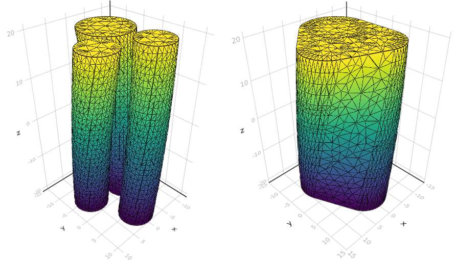
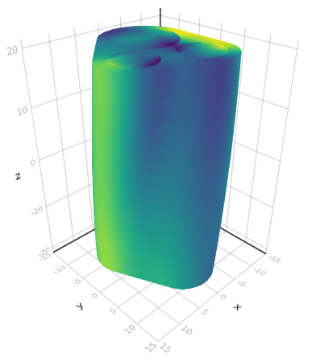

# Solve BTPDE

We start by loading SpinDoctor.

```julia
using LinearAlgebra
using SpinDoctor
```

The built in geometry recipes allow for making various cell configuration. We here consider
the case of twisted axons immersed in an extracellular space (ECS).

```julia
setup = CylinderSetup(;
    name = "some-very-real-axons",
    ncell = 3,
    rmin = 2.0,
    rmax = 6.0,
    dmin = 0.2,
    dmax = 0.3,
    height = 40.0,
    bend = 0.0,
    twist = π / 4,
    include_in = false,
    in_ratio = 0.6,
    ecs_shape = :convex_hull,
    ecs_ratio = 0.5,
)
```

We also define coefficients for the different cell compartments `:in` (axon), `:out`
(myelin), and `:ecs` (ECS).

```julia
coeffs = coefficients(
    setup;
    D = (; in = 0.002 * I(3), out = 0.002 * I(3), ecs = 0.002 * I(3)),
    T₂ = (; in = Inf, out = Inf, ecs = Inf),
    ρ = (; in = 1.0, out = 1.0, ecs = 1.0),
    κ = (; in_out = 1e-4, out_ecs = 1e-4, in = 0.0, out = 0.0, ecs = 0.0),
    γ = 2.67513e-4,
)
```

The following line creates a random cell configuration for our cylinder setup, generates a
surface triangulation and calls TetGen to create a tetrahedral finite element mesh. The
compartments and boundaries will be ordered in the same way as `coeffs`.

```julia
mesh, = create_geometry(setup)
```

The resulting mesh can be plotted in 3D provided the `GLMakie` backend is loaded.

```julia
using GLMakie
plot_mesh(mesh)
```



The mesh looks good, so we can proceed with the assembly our biological model and the
associated finite element matrices.

```julia
model = Model(; mesh, coeffs...)
matrices = assemble_matrices(model)
```

The Bloch-Torrey PDE takes a magnetic field gradient pulse sequence as an input. Here
we use `ScalarGradient` with a PGSE sequence.

```julia
dir = [1.0, 0.0, 0.0]
profile = PGSE(2000.0, 6000.0)
b = 1000
g = √(b / int_F²(profile)) / coeffs.γ
gradient = ScalarGradient(dir, profile, g)
```

SpinDoctor provides a `solve` function, which has the same base signature for all diffusion
MRI problems. The BTPDE is one such problem. They generally take a gradient sequence as an
input.

```julia
btpde = GeneralBTPDE(; model, matrices)
ξ = solve(btpde, gradient)
```

Here, `ξ` is a vector containing the complex-valued magnetization at all degrees of freedom
at the echo time `TE`. We may compute the resulting signal as follows:

```julia
compute_signal(matrices.M, ξ)
```

The global mass matrix `M` is used to compute the integral. We may however be interested in
the compartment-wise signals. This requires splitting the magnetization field into the
respective compartments. The compartment mass matrices are also available.

```julia
ξ_cmpts = split_field(mesh, ξ)
compute_signal.(matrices.M_cmpts, ξ_cmpts)
```

The final magnetization can be visualized using the `plot_field` function.

```julia
plot_field(mesh, ξ)
```


